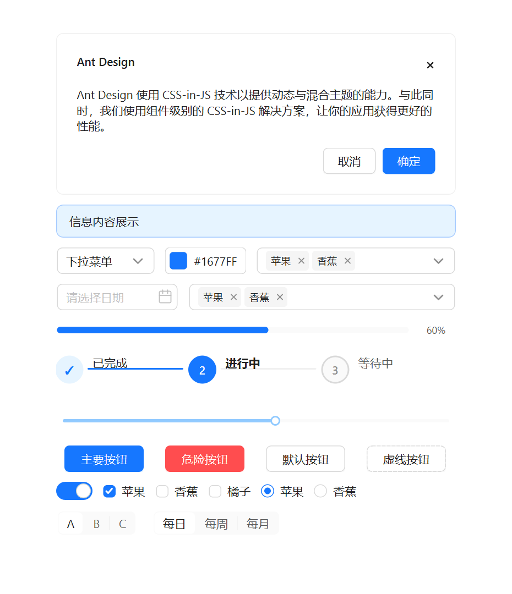
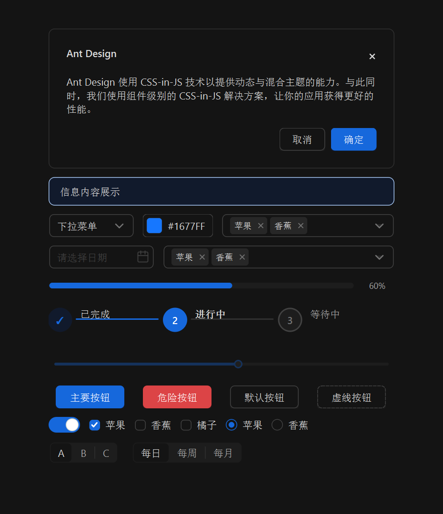

# qt-ant-design

English | [简体中文](README.zh-CN.md)

`qt-ant-design` is a C++ component library built on Qt 6 Widgets that ports the Ant Design system to native desktop widgets.

The project focuses on:

- Dynamic light / dark theme switching
- Faithful reproduction of Ant Design's interactions and state styles
- A maintainable desktop rendering stack built on `QPainter` / `QProxyStyle`

> Current implementation and visual-audit status are tracked in [docs/project-status.md](docs/project-status.md) and [docs/visual-audit.md](docs/visual-audit.md).

> Issues and PRs are welcome: visual mismatches, missing interactions, Qt integration problems, documentation gaps, component fixes, tests, examples, and docs improvements are all appreciated.

## Showcase

| Light | Dark |
| --- | --- |
|  |  |

## Features

- Built on Qt 6 Widgets — lightweight, easy to embed, and consumable as a static library in existing projects
- Built-in Design Token system with real-time light / dark theme switching
- `82` public components ported so far (full coverage of Ant Design's `70 / 70` standard components, plus `12` Qt / desktop extension components)
- `62` style-driven components are rendered through a `QProxyStyle` architecture
- The example app currently demos `82 / 82` public components, plus a standalone Ant Design homepage-style `Showcase`
- `AntIcon` bundles `831` official SVG resources from `@ant-design/icons-svg@4.4.2`
- Comparable standard components are tracked as visual-audit `Pass`; Qt-only desktop extensions are tracked as `Local Pass`
- Clean code structure — `core / styles / widgets / examples` layering keeps the project easy to extend

## Current Status

- Status snapshot: [docs/project-status.md](docs/project-status.md)
- Visual audit matrix: [docs/visual-audit.md](docs/visual-audit.md)
- Official icon inventory: [docs/ant-design-icons.md](docs/ant-design-icons.md)
- Latest full Debug verification: `34 / 34` CTest targets passed on `2026-05-01`

## Recent Ant Design Parity Updates

The 2026-04-30 interaction and motion pass tightened several user-visible details:

- Popup feedback: `AntPopover`, `AntMessage`, and `AntNotification` now have more stable hover/close behavior, stronger elevation, and placement-aware enter/exit motion.
- Motion: `AntCarousel`, `AntTabs`, `AntSkeleton`, `AntSpin`, `AntInputNumber`, `AntSwitch`, and loading buttons now better match Ant Design timing, direction, and state feedback.
- Data interaction: `AntTransfer` now supports scrolling and header select-all correctly, while `AntTable` sorter clicks reorder rows instead of only changing the icon state.
- Input feedback: `AntPlainTextEdit` supports TextArea-style bottom-right resizing, and `AntSlider` shows a value bubble while dragging.

## Installation & Integration

### Requirements

- Qt `6.5+`
- CMake `3.16+`
- C++17

### Option 1: Add as a CMake subdirectory

```bash
git submodule add https://github.com/sorrowfeng/qt-ant-design.git third_party/qt-ant-design
git submodule update --init --recursive
```

```cmake
cmake_minimum_required(VERSION 3.16)
project(my-qt-app LANGUAGES CXX)

set(CMAKE_CXX_STANDARD 17)
set(CMAKE_CXX_STANDARD_REQUIRED ON)

find_package(Qt6 REQUIRED COMPONENTS Core Widgets)

add_subdirectory(third_party/qt-ant-design)

add_executable(my-qt-app main.cpp)
target_link_libraries(my-qt-app PRIVATE Qt6::Core Qt6::Widgets qt-ant-design)
```

### Option 2: Install and use the CMake package

```bash
cmake -S . -B build -DCMAKE_INSTALL_PREFIX=/path/to/install
cmake --build build --config Release
cmake --install build --config Release
```

Then point your consumer project at the install prefix:

```cmake
find_package(Qt6 REQUIRED COMPONENTS Core Widgets Svg)
find_package(qt-ant-design CONFIG REQUIRED)

add_executable(my-qt-app main.cpp)
target_link_libraries(my-qt-app PRIVATE
    qt-ant-design::qt-ant-design
)
```

Configure the consumer with `-DCMAKE_PREFIX_PATH=/path/to/install` if the prefix is not already on CMake's package search path.

On Windows you can also run the example app from the install directory directly:

```powershell
.\install\bin\qt-ant-design-example.exe
```

## Quick Start

```bash
git clone https://github.com/sorrowfeng/qt-ant-design.git
cd qt-ant-design
mkdir build && cd build
cmake .. -DCMAKE_PREFIX_PATH=/path/to/Qt6
cmake --build .
```

On Windows / multi-config generators, the recommended workflow is:

```powershell
cmake -S . -B build -DCMAKE_INSTALL_PREFIX=D:/Project/GitProject/qt-ant-design/install
cmake --build build --config Debug
cmake --install build --config Debug
.\install\bin\qt-ant-design-example.exe
```

### Your first `AntButton`

```cpp
#include <QApplication>
#include <QVBoxLayout>
#include <QWidget>

#include "widgets/AntButton.h"

int main(int argc, char* argv[])
{
    QApplication app(argc, argv);

    QWidget window;
    auto* layout = new QVBoxLayout(&window);

    auto* button = new AntButton("Primary");
    button->setButtonType(Ant::ButtonType::Primary);
    layout->addWidget(button);

    window.resize(360, 200);
    window.show();

    return app.exec();
}
```

## Ported Components

Total public components implemented: `82`

`src/widgets` currently contains `83` `Ant*.h` headers; `AntSelectPopup` is an internal popup helper and is not counted as a public component.

Ant Design standard components are counted by the top-level directories under [`ant-design/ant-design`](https://github.com/ant-design/ant-design)'s `components/` directory, with `row / col` rolled into `grid`, `back-top` rolled into `float-button`, and `qrcode` treated as a compatibility alias for `qr-code` — yielding a baseline of `70` standard components.

| Category | Components | Rendering |
| --- | --- | --- |
| General | `AntButton` `AntFloatButton` `AntIcon` `AntTypography` | `QProxyStyle` |
| Navigation | `AntAnchor` `AntBreadcrumb` `AntDropdown` `AntMenu` `AntPagination` `AntSteps` `AntTabs` | Mixed (`QProxyStyle` / custom paint) |
| Data Entry | `AntAutoComplete` `AntCascader` `AntCheckbox` `AntColorPicker` `AntDatePicker` `AntDescriptions` `AntForm` `AntInput` `AntInputNumber` `AntMentions` `AntRadio` `AntRate` `AntSegmented` `AntSelect` `AntSlider` `AntSwitch` `AntTimePicker` `AntTransfer` `AntTreeSelect` `AntUpload` | Mixed (`QProxyStyle` / custom paint) |
| Feedback | `AntAlert` `AntDrawer` `AntMessage` `AntModal` `AntNotification` `AntPopconfirm` `AntPopover` `AntProgress` `AntResult` `AntSkeleton` `AntSpin` `AntTooltip` `AntTour` `AntWatermark` | Mixed (`QProxyStyle` / custom paint) |
| Data Display | `AntAvatar` `AntBadge` `AntCalendar` `AntCard` `AntCarousel` `AntCollapse` `AntEmpty` `AntImage` `AntList` `AntQRCode` `AntStatistic` `AntTable` `AntTag` `AntTimeline` `AntTree` | Mixed (`QProxyStyle` / custom paint) |
| Layout & Misc | `AntAffix` `AntApp` `AntConfigProvider` `AntDivider` `AntFlex` `AntGrid` `AntLayout` `AntMasonry` `AntSpace` `AntSplitter` `AntWidget` `AntWindow` | Mixed (`QProxyStyle` / custom paint / QObject helper) |
| Qt / Desktop Extensions | `AntDockWidget` `AntLog` `AntMenuBar` `AntPlainTextEdit` `AntScrollArea` `AntScrollBar` `AntStatusBar` `AntToolBar` `AntToolButton` | Mixed (`QProxyStyle` / custom paint) |

### Component Highlights

- `AntButton`: five types, three sizes, three shapes, `loading / danger / ghost / block`
- `AntIcon`: `831` official SVG icons, string-name API, `Outlined / Filled / TwoTone`, rotation, spin, custom paths
- `AntInput`: sizes, states, `addonBefore / addonAfter / allowClear / password`
- `AntInputNumber`: sizes, states, variants, prefix/suffix, precision, fine-grained step, optional control buttons
- `AntDescriptions`: title, extra, columns, bordered, vertical, custom value widgets
- `AntForm`: `AntForm / AntFormItem`, horizontal / vertical / inline layouts, label alignment, required marker, help and validation hints
- `AntEmpty`: default illustration, `simple` mode, description text, custom illustration size and extra action
- `AntDropdown`: `hover / click / contextMenu` triggers, placement, arrow, auto flip
- `AntSteps`: horizontal / vertical layout, current step, error state, click to switch, title / description / subtitle
- `AntSelect`: sizes, states, variants, `allowClear / loading / popup`
- `AntAlert`: `success / info / warning / error`, icon, description, closable, banner, custom action
- `AntModal`: mask, title, body, custom content, custom footer, confirm / cancel, centered or top-offset layout
- `AntResult`: status icons (success / error / warning / info), title, description, custom extra actions area
- `AntList`: `header / footer / bordered / split / size`; `AntListItem` supports `Meta` (avatar, title, description) and an action area
- `AntStatistic`: numeric display, thousands separators, prefix / suffix, precision control
- `AntPopover`: title, body, action, click / hover triggers, placement, arrow
- `AntPopconfirm`: confirm title, description, confirm / cancel buttons, disabled state, placement
- `AntSkeleton`: moving `active` shimmer, avatar placeholder, title / paragraph configuration, rounded style, and `loading` toggle to swap in real content
- `AntTooltip`: common `placement`, arrow, color, delayed display, auto flip
- `AntSlider`: horizontal / vertical, `reverse / dots / included`, drag value bubble
- `AntSwitch`: `checked / loading / small / text`, click wave feedback
- `AntSpin`: `small / middle / large / percent / delay`, smoother high-frequency animation
- `AntDatePicker` / `AntTimePicker`: hand-painted popup pickers
- `AntMessage` / `AntNotification`: global feedback components with elevated surfaces and enter / exit motion
- `AntCard` / `AntTag` / `AntBadge` / `AntAvatar`: common display components
- `AntMenu` / `AntTabs` / `AntBreadcrumb` / `AntPagination`: navigation components
- `AntTable`: data table with column sorting, row selection (checkbox / radio), pagination, loading state
- `AntTree`: tree control with expand / collapse, node selection, checkboxes, connector lines
- `AntUpload`: file upload supporting text list, picture list, and picture card modes
- `AntCascader`: cascading selector with multi-column popup, click / hover expansion
- `AntTreeSelect`: tree selector that renders a tree inside a dropdown
- `AntRate`: rating component with `count / value / allowHalf / allowClear / disabled / size`, hover scaling, left / right keyboard control
- `AntWidget`: base QWidget subclass that handles theme switching automatically
- `AntTypography`: theme-aware text component, Title (H1–H5) / Text / Paragraph, with type / decoration / copy / ellipsis support
- `AntWindow`: frameless window with custom title bar, dragging, minimize / maximize / close buttons
- `AntDrawer`: sliding panel with Left / Right / Top / Bottom placement, animation, and mask
- `AntStatusBar`: status bar with left / right items, separators, message area, and size grip
- `AntScrollBar`: custom 8 px slim scrollbar with auto-hide and no arrow buttons
- `AntSegmented`: segmented control with evenly distributed options, animated indicator, and icon / disabled / tooltip support
- `AntFloatButton`: floating action button — circle / square, Primary / Default, expandable Group, BackTop, Badge
- `AntWatermark`: watermark overlay with rotated tiled text, multi-line content, and customizable font / color / spacing / offset / angle
- `AntQRCode`: QR code display with embedded generator (no external dependency), status overlays (expired / loading / scanned), icon, no border
- `AntAffix`: pin helper — a QObject utility that watches the scroll container and auto-pins / un-pins while preserving layout
- `AntAutoComplete`: autocomplete input with popup suggestions and keyboard navigation
- `AntCalendar`: calendar panel with Day / Month / Year mode switching and date selection
- `AntCarousel`: carousel with autoplay, dot indicators, animated slide transitions, and click-to-page
- `AntCollapse`: collapse panel / accordion with InOutCubic expand animation and accordion exclusivity
- `AntColorPicker`: inline color trigger with optional text, plus popup HS field + value slider + RGB / HSV inputs, preset and custom colors
- `AntImage`: image display with placeholder fallback and click-to-fullscreen preview
- `AntTransfer`: transfer component with two scrollable lists, header select-all, and batch movement
- `AntTour`: masked step-by-step guide with target highlighting and Prev / Next / Finish
- `AntMentions`: `@` mentions input that pops suggestions on `@`
- `AntGrid` (Row/Col): 24-column grid with span / offset / gutter
- `AntFlex`: flex layout container with gap / wrap / vertical
- `AntMasonry`: masonry layout (shortest-column-first)
- `AntSplitter`: draggable splitter with theme-colored handle
- `AntAnchor`: scroll anchor navigation with active link highlighting
- `AntApp`: application wrapper providing message / modal / notification context
- `AntConfigProvider`: global configuration for theme / primary color / font size / border radius
- `AntToolButton`: QToolButton + QProxyStyle with dropdown arrow animation
- `AntMenuBar`: themed QMenuBar
- `AntToolBar`: themed QToolBar with floating shadow
- `AntDockWidget`: dockable panel with custom title bar and Win32 resize edges
- `AntScrollArea`: QScrollArea + AntScrollBar + QScroller gesture scrolling
- `AntPlainTextEdit`: multi-line text editor with 3 variants, TextArea-style resize grip, and a context menu
- `AntLog`: 5-level colored log output (Debug / Info / Success / Warning / Error) with timestamps

## Usage Examples

### AntButton

```cpp
#include "widgets/AntButton.h"

auto* primary = new AntButton("Save");
primary->setButtonType(Ant::ButtonType::Primary);
primary->setButtonSize(Ant::ButtonSize::Middle);

auto* danger = new AntButton("Delete");
danger->setDanger(true);
```

### AntInput

```cpp
#include "widgets/AntInput.h"

auto* input = new AntInput();
input->setPlaceholderText("Please enter a name");
input->setAllowClear(true);
input->setInputSize(Ant::InputSize::Large);
```

### AntCard

```cpp
#include "widgets/AntCard.h"
#include "widgets/AntTypography.h"

auto* card = new AntCard("User Profile");
card->setExtra("More");
card->setHoverable(true);
card->bodyLayout()->addWidget(new AntTypography("Card content"));
```

### Theme switching

```cpp
#include "core/AntTheme.h"

AntTheme::instance()->setThemeMode(Ant::ThemeMode::Dark);
```

A theme switch currently triggers `polish / updateGeometry / update` on every `QProxyStyle`-based component.

## Development Guide & Contributing

The project uses `AGENTS.md` as the AI collaboration spec and project sync document, tracking:

- Ported component list
- Visual audit checklist
- Current architectural conventions
- Example coverage
- Build and install instructions

The per-component visual audit tracker lives in `docs/visual-audit.md`.

When adding a new component, the recommended flow is:

1. Read the API and styles in [`ant-design/ant-design`](https://github.com/ant-design/ant-design) under `components/<component>/`
2. Reference similar Qt widget implementations in [`Liniyous/ElaWidgetTools`](https://github.com/Liniyous/ElaWidgetTools) when useful
3. Add `src/widgets/Ant<Name>.h/.cpp`
4. If style decoupling is needed, add `src/styles/Ant<Name>Style.h/.cpp`
5. Add a demo page in `examples/ExampleWindow.cpp`
6. Update `AGENTS.md` and `README.md`

Issues and PRs are welcome.

## Acknowledgements

- Thanks to Ant Design for the design system, component specs, and token foundation: [ant-design/ant-design](https://github.com/ant-design/ant-design)
- Thanks to ElaWidgetTools for Qt widget references: [Liniyous/ElaWidgetTools](https://github.com/Liniyous/ElaWidgetTools)
- Development note: 90%+ of this project was developed with Codex GPT-5.5; the rest was completed with Claude Code and Mimo v2.5 Pro.

## License

MIT License
